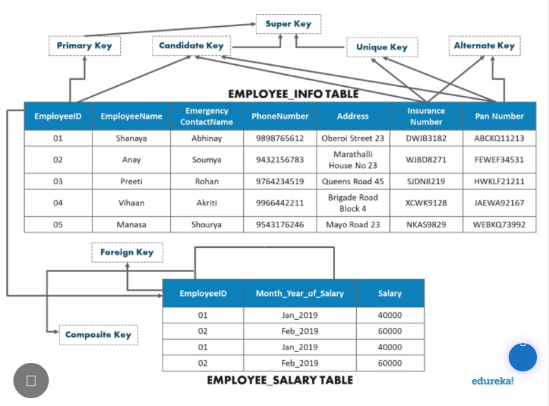

# PRMP_SQL

## A little something on SQL keys



>* Candidate Key – A set of attributes which can uniquely identify a table can be termed as a Candidate Key. A table can have more than one candidate key, and out of the chosen candidate keys, one key can be chosen as a Primary Key. In the above example, since EmployeeID, InsuranceNumber and PanNumber can uniquely identify every tuple, they would be considered as a Candidate Key.
>* Super Key – The set of attributes which can uniquely identify a tuple is known as Super Key. So, a candidate key, primary key, and a unique key is a superkey, but vice-versa isn’t true.
>* Primary Key – A set of attributes which are used to uniquely identify every tuple is also a primary key. In the above example, since EmployeeID, InsuranceNumber and PanNumber are candidate keys, any one of them can be chosen as a Primary Key. Here EmployeeID is chosen as the primary key.
>* Alternate Key – Alternate Keys are the candidate keys, which are not chosen as a Primary key. From the above example, the alternate keys are PanNumber and Insurance Number.
>* Unique Key –  The unique key is similar to the primary key, but allows one NULL value in the column. Here the Insurance Number and the Pan Number can be considered as unique keys.
>* Foreign Key – An attribute that can only take the values present as the values of some other attribute, is the foreign key to the attribute to which it refers. in the above example, the Employee_ID from the Employee_Information Table is referred to the Employee_ID from the Employee_Salary Table.
>* Composite Key – A composite key is a combination of two or more columns that identify each tuple uniquely. Here, the Employee_ID and Month-Year_Of_Salary can be grouped together to uniquely identify every tuple in the table.

## prmp_sql

> A convience SQLite library.
>
>Still implementing the codes in *lib* and *lib2* to see the best implementations.

## 1. Example 1

>    ``` SQL
>    -- SQL SELECT SYNTAX
>
>    SELECT NAME
>        FROM SALESREPS
>        WHERE (REP_OFFICE IN (22, 11, 12))
>        OR (MANAGER IS NULL AND HIRE_DATE >= '2006-06-01')
>        OR (SALES > QUOTA AND NOT SALES > 600000.0);
>    ```
>
>    ``` PY
>    # PYTHON SELECT SYNTAX
>    # formatted like this to show every parameters literally
>
>    SELECT(
>        Columns(
>            "NAME",
>        ),
>        FROM(
>            "SALESREPS",
>        ),
>        where=WHERE(
>            OR(
>                OR(
>                    IN(
>                        "REP_OFFICE",
>                        (22, 11, 12),
>                    ),
>                    AND(
>                        IS_NULL(
>                            "MANAGER",
>                        ),
>                        GREATER_THAN_EQUAL(
>                            "HIRE_DATE",
>                            CONSTANT(
>                                "2006-06-01",
>                            ),
>                        ),
>                    ),
>                ),
>                AND(
>                    GREATER_THAN(
>                        "SALES",
>                        "QUOTA",
>                    ),
>                    NOT(
>                        GREATER_THAN(
>                            "SALES",
>                            600000.00,
>                        ),
>                    ),
>                ),
>            )
>        ),
>    )
>    ```
>
>    ``` SQL
>    -- PYTHON OUTPUT
>
>    SELECT NAME
>        FROM SALESREPS
>    WHERE (((REP_OFFICE IN (22, 11, 12))
>        OR (MANAGER IS NULL AND (HIRE_DATE >= '2006-06-01')))
>        OR ((SALES > QUOTA) AND NOT (SALES > 600000.0)))
>    ```

## 2. Example 2

>    ``` SQL
>    -- SQL SELECT SYNTAX
>
>    SELECT *
>    FROM city main_city
>    WHERE population > (
>    SELECT AVG(population)
>    FROM city average_city
>    WHERE average_city.country_id = main_city.country_id
>    );
>    ```
>
>    ``` PY
>    # PYTHON SELECT SYNTAX
>    # formatted like this to show every parameters literally
>
>    SELECT(
>        "*",
>        FROM(AS("city", "main_city", hide=True)),
>        where=WHERE(
>            GREATER_THAN(
>                "population",
>                SELECT(
>                    AVG("population"),
>                    FROM(AS("city", "average_city", hide=True)),
>                    where=WHERE(EQUAL(Column('country_id', table='average_city'), Column>('country_id', table='main_city'))),
>                ),
>            )
>        ),
>    )
>    ```
>
>    ``` SQL
>    -- PYTHON OUTPUT
>    SELECT * 
>    FROM city main_city
>    WHERE (population > (
>        SELECT AVG(population)
>        FROM city average_city
>        WHERE (average_city.country_id = main_city.country_id)))
>    ```

## Example on creating a database and creating tables in it

>
>``` py
>st1 = CREATE_TABLE(
>    "users",
>    UNIQUE(VARCHAR("id")),
>    VARCHAR("name"),
>    BLOB("icon"),
>    BLOB("key"),
>    VARCHAR("description"),
>)
>st2 = CREATE_TABLE(
>    "objects",
>    UNIQUE(VARCHAR("object_id")),
>    VARCHAR("name"),
>    BLOB("icon"),
>    VARCHAR("description"),
>    VARCHAR("object_type"),
>    VARCHAR("creator"),
>    INT("total_members"),
>)
>st3 = CREATE_TABLE(
>    "chats",
>    VARCHAR("user_id"),
>    VARCHAR("recipient_id"),
>    VARCHAR("text"),
>    BLOB("data"),
>    VARCHAR("type"),
>    VARCHAR("datetime"),
>    VARCHAR("path"),
>    BOOLEAN("sent"),
>    VARCHAR("recipient_type"),
>)
>st4 = CREATE_TABLE(
>    "members",
>    BOOLEAN("admin"),
>    BOOLEAN("is_contact"),
>    VARCHAR("member_id"),
>    VARCHAR("name"),
>    BLOB("icon"),
>    VARCHAR("description"),
>    VARCHAR("member_type"),
>)
>
>
>st = [st1, st2, st3]
># st.debug()
>
>db = DB('peachy.db')
>db.init()
>
>for a in st: db.exec(a)
>db.commit()
>db.close()
>
>```
